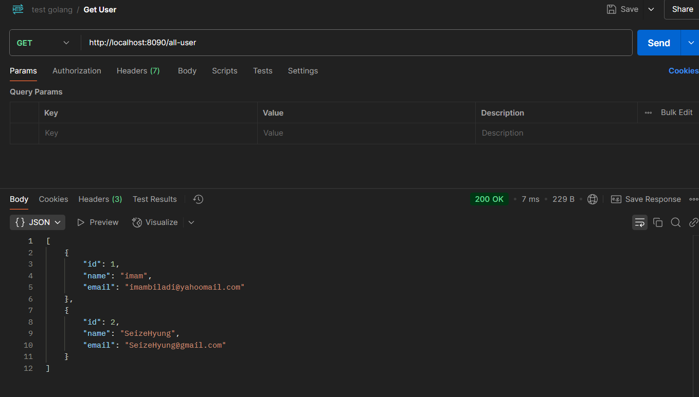
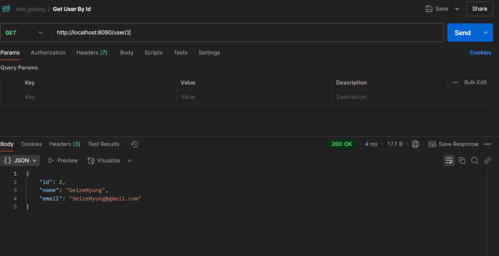
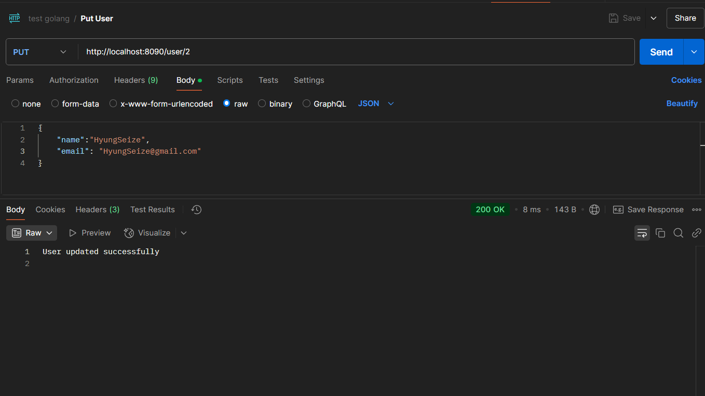
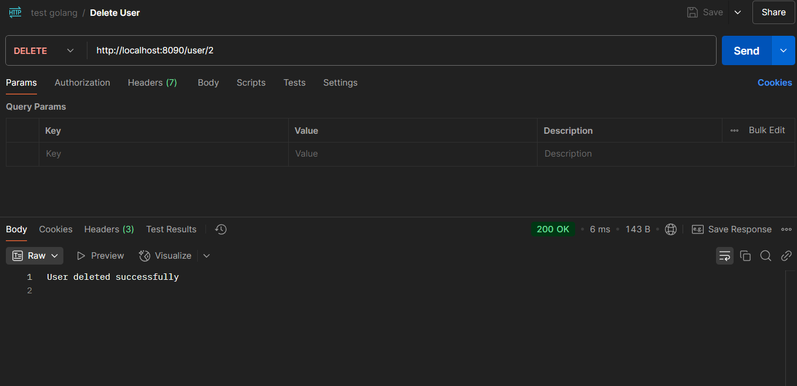

This project is a simple CRUD (Create, Read, Update, Delete) REST API built with native Go (Golang). It serves as a mini portfolio to demonstrate basic RESTful API operations using Go without any frameworks.

## Features

- Create, read, update, and delete data through RESTful endpoints
- Clean and easy-to-understand Go code
- Suitable for beginners learning Go and REST API concepts

## Screenshots: Mini Portfolio API in Action

Below are some screenshots showing the API endpoints in use:

  
_Testing the REST API endpoint to get all data._

  
_Testing the REST API endpoint to get data by ID._

  
_Testing the REST API endpoint to update data by ID._

  
_Testing the REST API endpoint to delete data by ID._

---

This Go REST API project is ideal for those looking to learn how to build and test simple CRUD operations, and can be easily found by searching for "Go REST API CRUD example" or "Golang simple CRUD portfolio".
